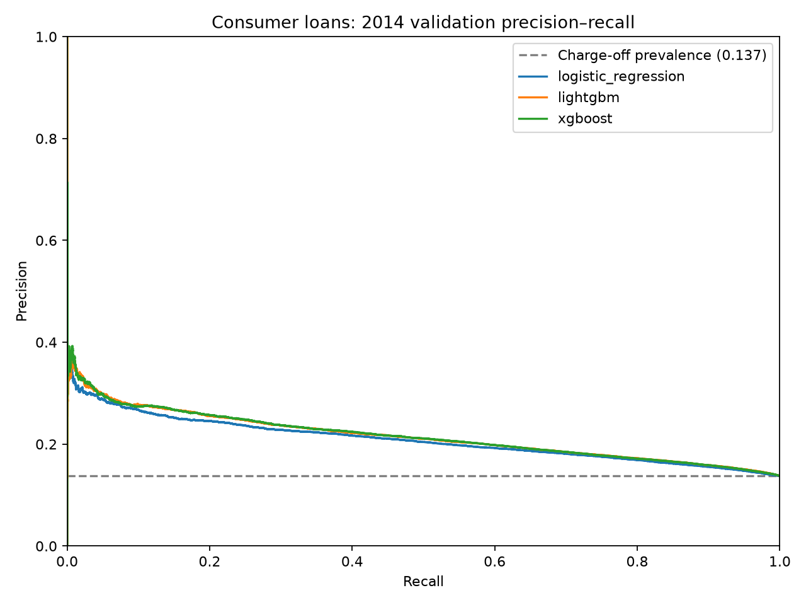
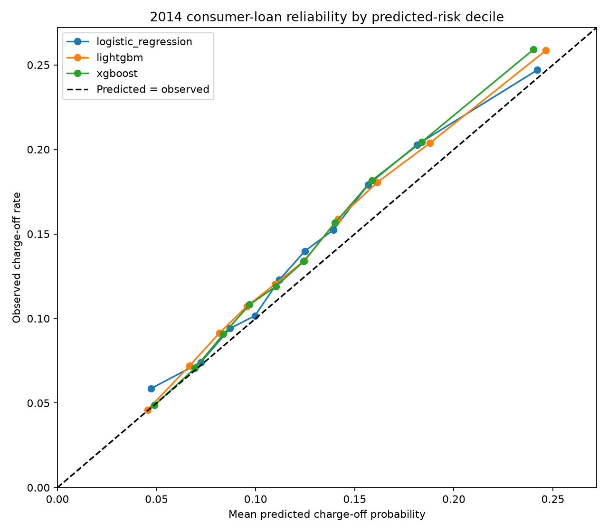
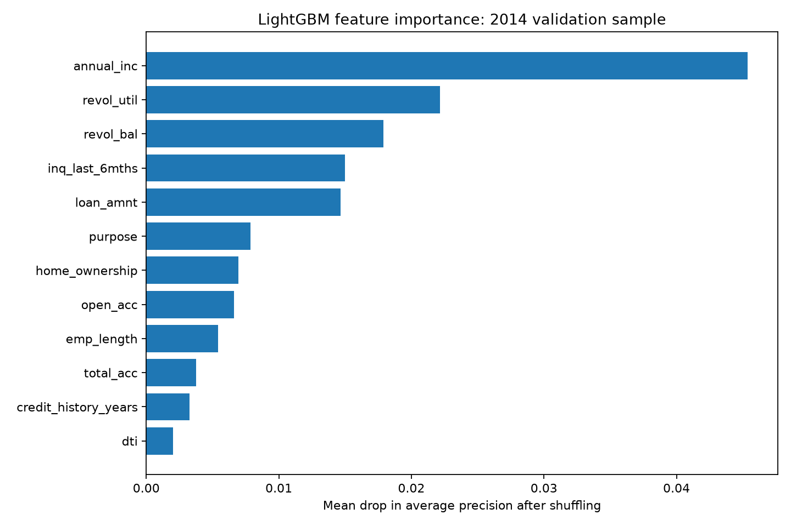

# Credit Risk Analytics: Fairness Audit and Consumer-Loan Portfolio

An interactive portfolio project with **two independent historical credit-risk studies**:

1. **Borrower delinquency:** estimate whether an applicant will experience serious delinquency within two years using Kaggle's [Give Me Some Credit](https://www.kaggle.com/competitions/GiveMeSomeCredit/data) dataset. Audit age-group errors, test a fairness mitigation method, examine explanations, and explore a hypothetical cost-based review policy.
2. **Consumer-loan charge-off:** estimate whether a completed 36-month Lending Club loan will eventually be charged off rather than fully paid. Train on loans issued in 2012–2013, assess on loans issued in 2014, and explore risk concentration, probability reliability, and loan-purpose patterns.

The [Streamlit dashboard](#interactive-dashboard) has a **Portfolio** switch. Each study has its own tabs and sidebar controls. Their targets, populations, time horizons, and scores differ; **the two AUC values should not be compared as if they measured the same task**.

> **Scope:** These are research and portfolio demonstrations using historical public datasets. Review flags and example scores are *not* loan approval decisions. Neither model is validated for use with current borrowers, Indian applicants, or a real bank's policies.

## Results at a glance

| Study | Validation design | Outcome rate | Provisional model | Ranking | Key finding |
| --- | --- | ---: | --- | --- | --- |
| Borrower delinquency | Stratified 80/20 split; 30,000 validation applicants | 6.68% serious delinquency within two years | LightGBM for the illustrative 10:1 cost scenario | ROC-AUC 0.8651; average precision 0.4001 | Age-group error gaps remain, and mitigating them raises illustrative cost |
| Consumer loans | 2012–2013 issue years for training; 162,570 loans issued in 2014 for validation | 13.73% eventual charge-off | LightGBM, provisionally | ROC-AUC 0.6475; average precision 0.2154 | The highest-risk 10% contains 18.83% of charge-offs, but probabilities underestimate the later year's rate |

The second study demonstrates a **modest** historical ranking result. It is included for its careful outcome definition, time-based validation, monitoring story, and portfolio interpretation—not because its model is ready to automate lending.

## Study 1: Two-year borrower delinquency

### Business question and data

The [Give Me Some Credit competition](https://www.kaggle.com/competitions/GiveMeSomeCredit/data) asks for the probability that a borrower experiences serious delinquency within two years. The labeled `cs-training.csv` contains 150,000 rows, ten original predictors, and `SeriousDlqin2yrs`. The separate `cs-test.csv` has no public outcome labels; it can be scored for a Kaggle submission, but its scores are **not** local test-set performance evidence.

The initial data audit identified issues that affect both modeling and interpretation:

| Finding in the raw training file | Treatment |
| --- | --- |
| 139,974 non-defaults (93.32%) and 10,026 defaults (6.68%) | Stratified split; report ROC-AUC and average precision rather than accuracy alone |
| `MonthlyIncome` missing in 29,731 rows (19.82%) | Training-set median imputation and a missingness indicator |
| `NumberOfDependents` missing in 3,924 rows (2.62%) | Training-set mode imputation and a missingness indicator |
| One record has age 0 | Remove it before splitting |
| Maximum unsecured revolving utilization 50,708; maximum debt ratio 329,664 | Cap at the training-set 99.5th percentiles and retain above-cap indicators |
| 609 exactly duplicated rows | Retain and document rather than silently delete |

After removing the invalid-age row, the 80/20 split contains **119,999 training** and **30,000 validation** applicants. Income imputations, dependent imputations, and caps are learned only from training data. The resulting model input has 13 features. **Age is excluded from model inputs**, but age buckets are retained for the fairness audit. Other features may still carry age-related information.

### Models and probability calibration

Five models share the same split. Logistic regression is an interpretable baseline, random forest a further tree baseline, and XGBoost, LightGBM, and a small ANN expand the comparison. Because the positive class is rare, the original boosted models used positive-class weighting. That helped address ranking imbalance but left their raw scores much higher than the observed default frequency.

| Model | ROC-AUC ↑ | Average precision ↑ | Calibrated Brier ↓ | Illustrative cost per 1,000 ↓ |
| --- | ---: | ---: | ---: | ---: |
| Logistic regression | 0.8280 | 0.3261 | 0.0534 | 392.3 |
| Random forest | 0.8612 | 0.3857 | 0.0498 | 341.9 |
| XGBoost | **0.8652** | 0.3974 | 0.0491 | 333.7 |
| LightGBM | 0.8651 | **0.4001** | **0.0489** | **332.9** |
| ANN | 0.8570 | 0.3842 | 0.0497 | 346.4 |

The validation default prevalence is **0.0668**, also the reference average precision for a constant ranking. The boosted models' mean *raw* scores were around 0.32. The evaluation fitted sigmoid calibration on labeled validation predictions with **two-fold out-of-fold scoring**: every reported calibrated prediction came from a calibrator fitted without that row. A final calibrator trained on all labeled validation rows is stored for dashboard scoring. Calibrated mean predictions were about 0.067, and LightGBM's Brier score fell from 0.1403 raw to 0.0489 calibrated.

These are still **validation results, not a fresh external test**. The same labeled split helped compare models and study fairness. XGBoost and LightGBM are close enough that the project does not claim a universally best algorithm.

### Illustrative decision costs

The first study assumes a missed default costs **ten units** and an unnecessary review costs **one unit**. With well-calibrated probabilities and constant error costs, the implied review cutoff is `1 / (10 + 1) = 0.0909`. At that cutoff, LightGBM produced **4,137 false positives**, **585 false negatives**, and **332.9 cost units per 1,000** applicants on the 30,000 validation rows.

Costs are **hypothetical units, not currency, expected credit loss, or bank-provided economics**. A false positive here means a non-defaulting person was *flagged for review*, not necessarily denied a loan. Changing the assumed ratio changes the comparison: LightGBM had the lowest measured cost at 5:1 and 10:1; XGBoost did at 20:1. The dashboard's borrower-risk sidebar recalculates decisions for the chosen model and cost ratio.


### Age-group fairness audit

With the calibrated LightGBM score and 9.09% review cutoff:

| Age group | Validation applicants | Observed default rate | Flagged for review | False-positive rate | True-positive rate |
| --- | ---: | ---: | ---: | ---: | ---: |
| Under 25 | 427 | 11.48% | 28.34% | 22.22% | 75.51% |
| 25–59 | 19,922 | 8.41% | 22.72% | 18.13% | 72.72% |
| 60+ | 9,651 | 2.91% | 9.42% | 7.94% | 58.72% |

Fairlearn reports **demographic-parity difference 0.1892** and **equalized-odds difference 0.1679**. For these metrics, a difference of 0.10 represents a ten-percentage-point gap. Age groups have different observed outcome rates, and the under-25 sample is small; the gaps warrant investigation rather than a simple claim that a metric alone proves discrimination.

For a mitigation experiment, Fairlearn `ThresholdOptimizer` was fitted on one half of the validation rows and assessed on the other **15,000**. The table compares policies **on the same assessment half**:

| LightGBM policy on 15,000 assessment rows | False positives | False negatives | Cost units / 1,000 | Demographic-parity difference | Equalized-odds difference |
| --- | ---: | ---: | ---: | ---: | ---: |
| Baseline 10:1 cutoff | 2,054 | 284 | **326.3** | 0.1903 | 0.1559 |
| Equalized-odds postprocessing, random seed 42 | 2,904 | 236 | 350.9 | **0.0429** | **0.0472** |

The measured gaps shrank while false positives and illustrative cost increased. The postprocessor uses **randomized age-group-specific decisions** and optimizes a different objective from the baseline. Other tested seeds produced different equalized-odds gaps. The under-25 assessment subgroup has only **205** applicants. This is a trade-off demonstration, **not a proposed production policy**.


### Explanations and reliability

SHAP summary and waterfall plots describe the raw LightGBM and XGBoost model outputs for selected applicants. Prior late payments and revolving credit utilization are prominent. Common-sample permutation importance checks which inputs change average precision when shuffled. SHAP magnitude and permutation-based AP drop are **different quantities**.

The example cases include a true positive, a false positive with several prior late payments, and a defaulting person near the decision boundary whom LightGBM missed. A local explanation describes why a model assigned a score; it does **not** demonstrate that a feature caused the outcome. Dashboard decisions use the **calibrated** probability, while tree SHAP plots explain the **raw** model output.


Overall calibrated mean predictions were near the observed 6.68% rate, but group reliability differed: among under-25 applicants, LightGBM predicted **9.65%** on average against **11.48%** observed; among applicants 60+, it predicted **3.87%** against **2.91%** observed. An overall mean near the target does not guarantee reliable subgroup probabilities.


## Study 2: Historical consumer-loan charge-off

### Why a separate target and cohort?

The second study uses a [Lending Club loan-level dataset on Kaggle](https://www.kaggle.com/datasets/adarshsng/lending-club-loan-data-csv), stored locally as `data/loan.csv` with `LCDataDictionary.xlsx` alongside it. Our copy has **2,260,668 rows and 145 columns**, with issue years from 2007 to 2018. This is a **US consumer-loan** dataset. `home_ownership = MORTGAGE` describes a borrower's housing status; it does **not** mean their Lending Club loan is a mortgage.

We streamed the 1.11 GB extracted CSV in chunks to inspect every loan's status and issue year:

| Original status | Rows | Share of all loans |
| --- | ---: | ---: |
| Fully Paid | 1,041,952 | 46.09% |
| Current | 919,695 | 40.68% |
| Charged Off | 261,655 | 11.57% |
| Other statuses, including late and grace-period loans | 37,366 | 1.65% |

`Current` means the final outcome is not yet known. Labelling current loans as successes would contaminate the target. For example, **303,588** of the 36-month loans issued in 2018 were still current in this snapshot.

We therefore selected **36-month loans issued in 2012–2014** whose statuses were `Fully Paid` or `Charged Off`. The full-file cohort check found no current or other statuses for those years and that term. We defined `target = 1` for eventual charge-off and `target = 0` for fully paid:

| Issue-year cohort | Role | Loans | Charge-offs | Charge-off rate |
| --- | --- | ---: | ---: | ---: |
| 2012–2013 | Training | 143,892 | 18,281 | 12.70% |
| 2014 | Later-year validation | 162,570 | 22,315 | 13.73% |

The validation year comes **after** the training years. This tests how the historical approach transfers to a later vintage. It does **not** establish 2026 performance. The target is an *eventual final status* for this selected 36-month cohort; it is **not** the same two-year event measured in Study 1.

### Inputs and leakage controls

The model uses a small set of application or prior-credit-history candidates: loan amount, annual income, debt-to-income ratio, employment length, housing status, purpose, revolving balance and utilization, account and inquiry counts, and a credit-history length derived from the earliest credit-line year and issue year. The saved training pipeline handles missing numeric values with a **training-fitted median** and categorical values with a missing category and one-hot encoding. `emp_length` was missing for **4.67%** of training and **5.93%** of validation loans; `revol_util` was missing in roughly 0.05–0.07%.

We excluded repayment totals, outstanding principal, recoveries, payment dates, hardship, and settlement information because they describe events **after** issue. We also excluded the lender's grade and interest rate from the first-pass feature set to avoid simply inheriting the lender's own pricing and assessment. `mort_acc` was left out because its missingness changed sharply between the selected training and validation years (4.19% in training and almost none in validation).

The intended scoring point is **loan issuance**. The public file does not independently prove the timestamp at which every retained field was recorded; a real deployment would need a field-level availability audit.

### Three models on the later-year cohort

Logistic regression gives an interpretable reference, while LightGBM and XGBoost are two tabular boosting candidates. All three were trained on the same 2012–2013 cohort and evaluated on the same 2014 rows:

| Model | ROC-AUC ↑ | Average precision ↑ | Brier ↓ | Mean predicted charge-off rate |
| --- | ---: | ---: | ---: | ---: |
| Logistic regression | 0.6367 | 0.2084 | 0.1154 | 12.63% |
| LightGBM | **0.6475** | 0.2154 | **0.1147** | 12.61% |
| XGBoost | 0.6474 | **0.2159** | 0.1148 | 12.56% |

The 2014 charge-off prevalence is **13.73%**, the average-precision reference for an uninformative constant ranking. A constant prediction of that prevalence has **Brier 0.1184**. The boosted models improve on those references, but their ROC-AUC around **0.65** and small Brier gains indicate **modest discrimination**. LightGBM and XGBoost are practically tied; LightGBM is the provisional dashboard model because its Brier score is fractionally lower. This is **not** a general claim that LightGBM is superior.



### Calibration and the later-year gap

The ten risk bands tell a consistent story: higher assigned risk corresponds to higher observed charge-off frequency, yet many bands are underpredicted. In LightGBM's highest-risk tenth, the mean score was **24.64%** and the observed charge-off rate was **25.85%**. Across all 2014 loans, LightGBM predicted **12.61%** versus **13.73%** observed.

We tested sigmoid calibration fitted through **three-fold out-of-fold training-period predictions** and evaluated its output on 2014 loans. It did not erase the later-year gap:

| Model | Version | 2014 mean prediction | 2014 Brier |
| --- | --- | ---: | ---: |
| LightGBM | Raw | 12.61% | **0.1147** |
| LightGBM | Calibrated on 2012–2013 | 12.62% | **0.1147** |
| XGBoost | Raw | 12.56% | **0.1148** |
| XGBoost | Calibrated on 2012–2013 | 12.58% | 0.1151 |

The original borrower models needed a substantial correction because class weighting pushed their raw scores far above prevalence. The consumer models were already close to **their training-period** prevalence. Calibration could not anticipate the **higher 2014 rate** without seeing later outcomes. The dashboard uses **raw LightGBM** for the historical scoring example; it does not claim the extra calibration succeeded.



### Portfolio interpretation and explainability

If a reviewer had capacity to inspect the **highest-scored 10%** of the 2014 loans using LightGBM:

| Review-queue measure | Historical result |
| --- | ---: |
| Loans in the queue | 16,257 |
| Charge-offs among those loans | 4,203 |
| Observed charge-off rate in the queue | 25.85% |
| Share of all 2014 charge-offs captured | 18.83% |
| Lift versus 2014 portfolio charge-off rate | 1.88× |

The queue concentrates risk but leaves **81.17%** of charge-offs outside it. Capture is retrospective; no intervention was tested, and the numbers do not show that manual review would prevent losses. The dashboard sidebar varies the capacity and model; its risk-decile chart follows the chosen model.

The loan-purpose analysis is descriptive. In 2014, `debt_consolidation` had **94,822 loans** and a **14.36%** charge-off rate; `small_business` had **1,634 loans** and **22.52%**. Purpose differences do **not** prove a causal relationship or justify a lending rule.

Permutation importance on a stratified **10,000-loan** 2014 sample found that shuffling `annual_inc` reduced average precision by **0.0454**, followed by `revol_util` (**0.0222**), `revol_bal` (**0.0179**), `inq_last_6mths` (**0.0150**), and `loan_amnt` (**0.0146**). This is a global ranking diagnostic, not the direction of effect or an individual explanation. The sample's starting average precision was **0.2211**, which differs from the full-cohort **0.2154**.



### What the results support

| Question | Evidence | Conclusion |
| --- | --- | --- |
| Can the borrower model rank two-year delinquency? | LightGBM average precision 0.4001 against 0.0668 prevalence | It ranks this validation sample substantially better than a constant-risk baseline; that does not validate another population |
| Is the borrower review policy equally accurate by age? | Different age-group flag, false-positive, and true-positive rates | The measured gaps require investigation. The tested mitigation reduces gaps but raises hypothetical cost |
| Can the consumer model identify concentrated risk? | Top 10% captures 18.83% of later-year charge-offs | It offers modest prioritization, while most charge-offs remain outside the queue |
| Are consumer probabilities stable over years? | LightGBM mean 12.61% versus 13.73% observed in 2014; training-period calibration made little difference | A later vintage may need monitoring and recalibration using genuinely new labeled outcomes |

The consumer outcomes do not establish an effect of reviewing, rejecting, or repricing any loan. No intervention or lender-specific financial benefit was measured.

## Interactive dashboard

Run `streamlit run dashboard.py`, then use the **Portfolio** switch in the left sidebar:

| Portfolio | Tabs | Sidebar controls |
| --- | --- | --- |
| Borrower delinquency | Overview, Data, Models, Policy & fairness, Explainability, Calibration, Score an applicant | Model, illustrative false-negative cost, optional manual cutoff |
| Consumer loans | Overview, Models, Review queue, Reliability, Drivers, Try a loan | Model for review ordering and share of 2014 loans reviewed |

The borrower scorer accepts either the ten original fields or a matching CSV. It applies the saved preprocessing, fitted model, and final calibrator. A CSV scored from `cs-test.csv` had **101,503 finite scores with unique IDs**; the dashboard's extra columns are **not** Kaggle's submission format, so use the submission script for Kaggle uploads. The hidden test labels cannot support local performance claims.

The consumer scorer begins from a **2014 validation row**. You can change its origination fields, choose one of the three models, and see a historical charge-off score and its approximate percentile among saved 2014 scores. The sidebar's review model and capacity affect the review-queue tab; the **Drivers** tab is explicitly the provisional LightGBM explanation. Example scoring does not make an approve/decline recommendation.

## Reproduce the project

### Environment and raw data

From the project root in Windows PowerShell:

```powershell
python -m venv .venv
.\.venv\Scripts\Activate.ps1
python -m pip install -r requirements.txt
```

Download the raw data separately and place the files at these paths:

```text
data/
  cs-training.csv          # Give Me Some Credit: required for Study 1
  cs-test.csv              # optional for Kaggle submission and batch scoring
  sampleEntry.csv          # optional competition sample
  loan.csv                 # Lending Club: required for Study 2 (~1.11 GB extracted)
  LCDataDictionary.xlsx    # optional reference
```

- [Give Me Some Credit competition data](https://www.kaggle.com/competitions/GiveMeSomeCredit/data) may require accepting its competition rules.
- [Lending Club loan data](https://www.kaggle.com/datasets/adarshsng/lending-club-loan-data-csv): use the version with `loan.csv`, 2,260,668 rows, and 145 columns to reproduce the numbers here. Data mirrors and versions can differ.

The repository deliberately **does not contain** the raw 1.11 GB Lending Club CSV, the Kaggle training data, generated processed CSVs, or fitted model binaries. Download the data and run training to enable scoring locally. Keep downloaded data subject to its source terms.

Before committing, check `git ls-files data` and `git status --short`. The project's `.gitignore` should exclude `data/`, `.venv/`, `__pycache__/`, generated prediction tables, and `*.joblib`. Selected small PNG charts can be committed to render this README on GitHub even though training outputs and raw datasets are excluded.

### Run Study 1

```powershell
python 01_eda.py
python 02_prepare_data.py
python 03_train_models.py
python 04_evaluate_policies.py
python 05_make_submissions.py       # optional: requires cs-test.csv
python 06_mitigation.py
python 07_explainability.py
python 08_reliability_check.py
```

This writes cleaned splits and preprocessing settings to `data/processed/`, and fitted models, tables, and charts to `outputs/`.

### Run Study 2

```powershell
python 09_inspect_loan_data.py          # optional: quick first-rows inspection
python 10_profile_loan_outcomes.py      # optional: full-file status scan
python 11_check_loan_cohorts.py         # optional: issue year × term × status
python 12_prepare_consumer_loans.py     # required: slim cohort files
python 13_train_consumer_models.py      # required: three models and predictions
python 14_consumer_reliability.py       # required for dashboard reliability chart
python 15_calibrate_consumer.py         # required for comparison table
python 16_consumer_portfolio_analysis.py # required for purpose table
python 17_consumer_feature_importance.py # required for Drivers tab
streamlit run dashboard.py
```

The first three scripts inspect `loan.csv` without fitting a model; 12 reads it in chunks and creates smaller files under `data/processed/`. Scripts 13–17 use those smaller files and save results under `outputs/consumer_loans/`. The dashboard requires both studies' generated files; its portfolio switch then displays each study separately. Training, calibration, SHAP, and the original fairness mitigation may take several minutes.

If you are distributing the project, include `requirements.txt`, `project_config.py`, `pipeline_utils.py`, `dashboard.py`, scripts 01–17 listed above, the README, and selected small PNG charts. Confirm `streamlit`, `lightgbm`, `xgboost`, `fairlearn`, and `shap` are declared in `requirements.txt`.

## Limitations and responsible interpretation

1. **Historical data and geography.** The Give Me Some Credit competition is old; Lending Club's loan file ends in 2018, with the consumer model validated on 2014. Neither result is a measured 2026 outcome or an Indian lending model.
2. **Different labels.** Study 1 predicts serious borrower delinquency within two years. Study 2 classifies eventual charge-off versus full payment in a selected 36-month cohort. Their AUCs, costs, rates, and thresholds are not interchangeable.
3. **Selected, issued populations.** Both datasets are observational. The consumer study includes loans that were issued and ultimately resolved; it does not model rejected applicants. Maturity-based cohort selection avoids calling current loans safe but narrows the applicable population.
4. **Feature timestamps.** Post-issue payment and recovery columns are excluded. The exact availability time of each retained public-data field has not been independently verified.
5. **Fairness coverage.** The borrower study audits selected age buckets but has no gender field. The Lending Club analysis has no age field, so it does not repeat the age audit. Income, purpose, and housing status deserve governance review; descriptive differences alone do not establish fairness.
6. **Evaluation reuse and uncertainty.** The borrower validation split supports several comparisons, even though individual calibration scores are out of fold; it is not a fresh external holdout. The consumer 2014 cohort was used to compare three candidate models and discuss findings. Small differences between leading models should not be oversold.
7. **Business assumptions.** The 10:1 borrower error-cost ratio is hypothetical. The consumer review queue is a retrospective prioritization exercise; it does not estimate financial savings or a treatment effect.
8. **Monitoring.** A real deployment would require current labelled vintages, a stable definition of default and observation horizon, feature availability checks, subgroup auditing, ongoing calibration and drift monitoring, operational review, and bank-specific cost evidence.

## Interview walkthrough

**Borrower study:** “I started with a 6.68% event rate, handled missing values and extreme ratios using training-only settings, compared five models, then audited age-group error rates at an illustrative decision cutoff. Fairness postprocessing reduced gaps but increased false positives and hypothetical cost, which is why I report the trade-off rather than claiming the problem was fixed.”

**Consumer-loan study:** “I streamed 2.26 million loan rows and noticed 40.68% were still current. I avoided treating those as non-defaults, selected mature 36-month cohorts, trained on 2012–2013, and validated on 2014. LightGBM and XGBoost only achieved about 0.65 ROC-AUC. The highest-risk tenth contained 18.83% of charge-offs; probabilities still underestimated the later-year event rate. I present it as a modest historical risk-ranking pilot, with explicit monitoring needs.”

**Project takeaway:** A convincing credit-risk analysis is more than a high leaderboard score. It needs a defensible label, inputs available at the decision point, evaluation aligned with time, probability reliability, subgroup scrutiny where attributes exist, and a clear account of operational trade-offs.
