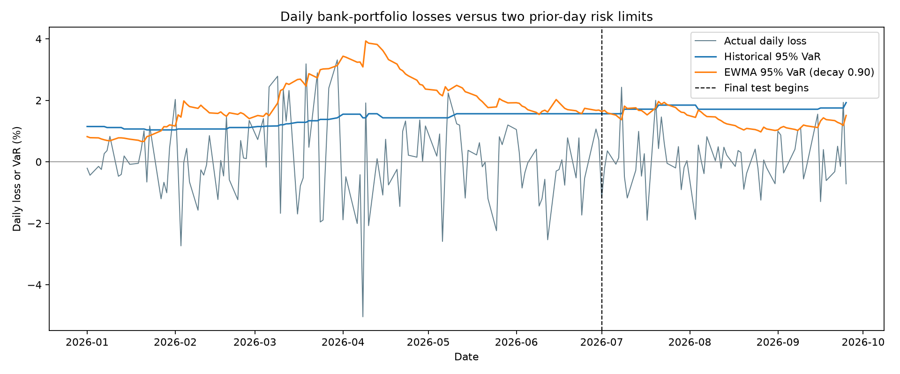
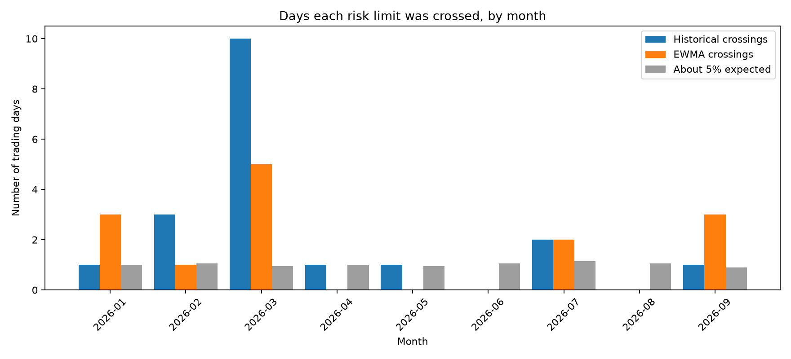

# BFSI Risk Analytics | Market Risk, Credit Fairness & Loan Portfolios

Three **independent risk studies** in one Streamlit dashboard. The first uses recent Indian NSE equity data to test daily market-loss alerts. The second models two-year borrower delinquency and audits age-group decision gaps. The third evaluates historical consumer-loan charge-off risk on a later loan cohort. The navigation in `dashboard.py` puts them in that order.

| Section | Question | Evaluation | Headline result |
| --- | --- | --- | --- |
| **1. Indian market risk** | Did a daily risk limit anticipate losses in an illustrative five-bank portfolio? | NSE 2025 history; Jan–Jun 2026 validation; Jul–25 Sep 2026 later check | In Mar 2026, historical 95% VaR was crossed **10/19** sessions; EWMA was crossed **5/19**. In Jul–Sep historical had **3/62** and EWMA **5/62** crossings. |
| **2. Borrower delinquency** | Who experienced serious delinquency within two years, and how do age-group errors differ? | Stratified 119,999 training / 30,000 validation applicants | LightGBM ROC-AUC **0.8651**, average precision **0.4001**, calibrated Brier **0.0489**. Fairness mitigation shrank measured gaps at higher illustrative cost. |
| **3. Consumer loan portfolio** | Which completed loans were more likely to charge off? | Train on 2012–13 loans; assess 162,570 loans issued in 2014 | LightGBM ROC-AUC **0.6475**, average precision **0.2154**. Highest-risk 10% contained **18.83%** of charge-offs. |

These sections have **different outcomes and populations**. A market-risk crossing, two-year delinquency, and eventual loan charge-off are not comparable AUC-style scores. This is a reproducible portfolio demonstration, not a live trading, investment-advice, or lending-decision system. The separate custom stock-management product is outside this repository.

## Study 1: Indian five-bank market risk

### Decision problem and source

For a fixed example portfolio, how often did the *next actual daily loss* exceed a loss limit estimated from previous trading days? The source is NSE's [CM-UDiFF Common Bhavcopy Final (ZIP)](https://www.nseindia.com/all-reports), one file per trading session. The audited collection contains **431 valid days** from 1 Jan 2025 to 25 Sep 2026, **1,384,871 security-day rows**, and **979,440 ordinary `EQ` equity-day rows**. It is daily closing-price data, not individual trades, an adjusted total-return feed, or a real client's positions.

The study fixes five NSE banking equities—`HDFCBANK`, `ICICIBANK`, `SBIN`, `AXISBANK`, and `KOTAKBANK`—at **20% each, rebalanced daily**. There are **2,155 stock-day rows** (five stocks × 431 sessions). Equal weighting makes the comparison reproducible; it is neither a suggested investment allocation nor evidence about a diversified portfolio. Fees, taxes, dividends, and trading impact are excluded.

### Data audit and corporate actions

| Check | Finding and treatment |
| --- | --- |
| Daily-file integrity | 431 readable ZIPs; no bad closing prices, missing previous closes, zero/missing volume, duplicate selected symbols, or file-date mismatches in the audit. |
| Special sessions | A weekday-only downloader initially missed **1 Feb 2025 (Saturday)** and **1 Feb 2026 (Sunday)**, when NSE held Union Budget sessions. Both were fetched before returns were finalized. |
| HDFC Bank | **1:1 bonus**, effective **26 Aug 2025**. The unadjusted price series appeared to fall 50.44%; share-count correction gave a **0.88%** daily loss. |
| Kotak Mahindra Bank | **5-for-1 split**, ex-date **14 Jan 2026**. The unadjusted series appeared to fall 80.26%; share-count correction gave a **1.29%** daily loss. |

Those two actions were checked against [NSE's HDFC Bank bonus circular](https://nsearchives.nseindia.com/content/circulars/FAOP69840.pdf) and [NSE's Kotak corporate-action listing](https://www.nseindia.com/companies-listing/corporate-filings-actions?symbol=KOTAKBANK&tabIndex=equity). The special sessions are recorded in NSE's [2025 notice](https://nsearchives.nseindia.com/web/sites/default/files/2025-01/ind_prs24012025_3.pdf) and [2026 circular](https://nsearchives.nseindia.com/content/circulars/CMTR72349.pdf). The correction was **specific to the verified five stocks and dates**; it must not be generalized automatically to arbitrary symbols. No other selected-stock daily move remained above the script's 20% review threshold.

### Time split and methods

| Period | Sessions | Role |
| --- | ---: | --- |
| 2025 | 249 | Initial return history and portfolio definition |
| Jan–Jun 2026 | 120 | Compare methods and select EWMA decay using validation quantile loss |
| Jul–25 Sep 2026 | 62 | Later-period check for the initially compared methods |

Each **one-day** forecast uses earlier returns only. **Historical 95% VaR** takes the 95th percentile of portfolio losses from up to the prior 250 sessions. **EWMA-normal 95% VaR** gives recent squared returns more weight to estimate current volatility, then multiplies volatility by the standard-normal 95% quantile. Among prelisted decays 0.90, 0.94, 0.97, and 0.99, **0.90** had the lowest January–June quantile loss. A *crossing* means actual daily loss exceeded that day's limit. At a nominal 95% level, about 5% of sessions are expected to cross over a sufficiently long period.

| Method | Jan–Jun crossings (120 days; 6 expected) | Jan–Jun quantile loss ↓ | Jul–Sep crossings (62 days; 3.1 expected) | Jul–Sep quantile loss ↓ |
| --- | ---: | ---: | ---: | ---: |
| Historical, rolling 250 | 16 (13.33%) | 0.001893 | **3 (4.84%)** | **0.001045** |
| EWMA-normal, decay 0.90 | **9 (7.50%)** | **0.001355** | 5 (8.06%) | 0.001069 |

**Interpretation:** EWMA reacted better during the difficult first half of 2026 but still crossed more often than the nominal 5%. Historical VaR did slightly better in the 62-day later period. Do not select a new method by repeatedly looking at that same later period and then call it an untouched test. New October/November outcomes, when available, can provide prospective evidence if the method and settings are frozen first.



### What the monitoring view reveals

March 2026 dominated the misses: **10 historical** and **5 EWMA** crossings in **19 sessions**, compared with about **one** expected at a 95% limit. Across Jan–Sep, historical had **19** and EWMA **14** crossings against **9.1** expected across **182** sessions. Their longest observed runs of consecutive-session crossings were three and two, respectively. On **30 Mar 2026**, the portfolio lost **3.32%**; SBIN contributed **0.79 percentage points** of that loss, the largest individual contribution that day. This is arithmetic attribution, not an explanation of why SBIN moved.

The interactive study shows a daily loss chart, month-by-month comparison, dated breach log, and stock contribution for a selected breach. It is a **fixed research portfolio**, not an arbitrary-stock or client-holdings risk engine. A separate project would need adjusted data across its supported stock universe, access controls, and commercial data permissions.



## Study 2: Two-year borrower delinquency

### Business question and data

The [Give Me Some Credit competition](https://www.kaggle.com/competitions/GiveMeSomeCredit/data) asks for the probability that a borrower experiences serious delinquency within two years. The labeled `cs-training.csv` contains 150,000 rows, ten original predictors, and `SeriousDlqin2yrs`. The separate `cs-test.csv` has no public outcome labels; it can be scored for a Kaggle submission, but its scores are **not** local test-set performance evidence.

The initial data audit identified issues that affect both modeling and interpretation:

| Finding in the raw training file | Treatment |
| --- | --- |
| 139,974 non-defaults (93.32%) and 10,026 defaults (6.68%) | Stratified split; report ROC-AUC and average precision rather than accuracy alone |
| `MonthlyIncome` missing in 29,731 rows (19.82%) | Training-set median imputation and a missingness indicator |
| `NumberOfDependents` missing in 3,924 rows (2.62%) | Training-set mode imputation and a missingness indicator |
| One record has age 0 | Remove it before splitting |
| Maximum unsecured revolving utilization 50,708; maximum debt ratio 329,664 | Cap at the training-set 99.5th percentiles and retain above-cap indicators |
| 609 exactly duplicated rows | Retain and document rather than silently delete |

After removing the invalid-age row, the 80/20 split contains **119,999 training** and **30,000 validation** applicants. Income imputations, dependent imputations, and caps are learned only from training data. The resulting model input has 13 features. **Age is excluded from model inputs**, but age buckets are retained for the fairness audit. Other features may still carry age-related information.

### Models and probability calibration

Five models share the same split. Logistic regression is an interpretable baseline, random forest a further tree baseline, and XGBoost, LightGBM, and a small ANN expand the comparison. Because the positive class is rare, the original boosted models used positive-class weighting. That helped address ranking imbalance but left their raw scores much higher than the observed default frequency.

| Model | ROC-AUC ↑ | Average precision ↑ | Calibrated Brier ↓ | Illustrative cost per 1,000 ↓ |
| --- | ---: | ---: | ---: | ---: |
| Logistic regression | 0.8280 | 0.3261 | 0.0534 | 392.3 |
| Random forest | 0.8612 | 0.3857 | 0.0498 | 341.9 |
| XGBoost | **0.8652** | 0.3974 | 0.0491 | 333.7 |
| LightGBM | 0.8651 | **0.4001** | **0.0489** | **332.9** |
| ANN | 0.8570 | 0.3842 | 0.0497 | 346.4 |

The validation default prevalence is **0.0668**, also the reference average precision for a constant ranking. The boosted models' mean *raw* scores were around 0.32. The evaluation fitted sigmoid calibration on labeled validation predictions with **two-fold out-of-fold scoring**: every reported calibrated prediction came from a calibrator fitted without that row. A final calibrator trained on all labeled validation rows is stored for dashboard scoring. Calibrated mean predictions were about 0.067, and LightGBM's Brier score fell from 0.1403 raw to 0.0489 calibrated.

These are still **validation results, not a fresh external test**. The same labeled split helped compare models and study fairness. XGBoost and LightGBM are close enough that the project does not claim a universally best algorithm.

### Illustrative decision costs

The borrower study assumes a missed default costs **ten units** and an unnecessary review costs **one unit**. With well-calibrated probabilities and constant error costs, the implied review cutoff is `1 / (10 + 1) = 0.0909`. At that cutoff, LightGBM produced **4,137 false positives**, **585 false negatives**, and **332.9 cost units per 1,000** applicants on the 30,000 validation rows.

Costs are **hypothetical units, not currency, expected credit loss, or bank-provided economics**. A false positive here means a non-defaulting person was *flagged for review*, not necessarily denied a loan. Changing the assumed ratio changes the comparison: LightGBM had the lowest measured cost at 5:1 and 10:1; XGBoost did at 20:1. The dashboard's borrower-risk sidebar recalculates decisions for the chosen model and cost ratio.


### Age-group fairness audit

With the calibrated LightGBM score and 9.09% review cutoff:

| Age group | Validation applicants | Observed default rate | Flagged for review | False-positive rate | True-positive rate |
| --- | ---: | ---: | ---: | ---: | ---: |
| Under 25 | 427 | 11.48% | 28.34% | 22.22% | 75.51% |
| 25–59 | 19,922 | 8.41% | 22.72% | 18.13% | 72.72% |
| 60+ | 9,651 | 2.91% | 9.42% | 7.94% | 58.72% |

Fairlearn reports **demographic-parity difference 0.1892** and **equalized-odds difference 0.1679**. For these metrics, a difference of 0.10 represents a ten-percentage-point gap. Age groups have different observed outcome rates, and the under-25 sample is small; the gaps warrant investigation rather than a simple claim that a metric alone proves discrimination.

For a mitigation experiment, Fairlearn `ThresholdOptimizer` was fitted on one half of the validation rows and assessed on the other **15,000**. The table compares policies **on the same assessment half**:

| LightGBM policy on 15,000 assessment rows | False positives | False negatives | Cost units / 1,000 | Demographic-parity difference | Equalized-odds difference |
| --- | ---: | ---: | ---: | ---: | ---: |
| Baseline 10:1 cutoff | 2,054 | 284 | **326.3** | 0.1903 | 0.1559 |
| Equalized-odds postprocessing, random seed 42 | 2,904 | 236 | 350.9 | **0.0429** | **0.0472** |

The measured gaps shrank while false positives and illustrative cost increased. The postprocessor uses **randomized age-group-specific decisions** and optimizes a different objective from the baseline. Other tested seeds produced different equalized-odds gaps. The under-25 assessment subgroup has only **205** applicants. This is a trade-off demonstration, **not a proposed production policy**.


### Explanations and reliability

SHAP summary and waterfall plots describe the raw LightGBM and XGBoost model outputs for selected applicants. Prior late payments and revolving credit utilization are prominent. Common-sample permutation importance checks which inputs change average precision when shuffled. SHAP magnitude and permutation-based AP drop are **different quantities**.

The example cases include a true positive, a false positive with several prior late payments, and a defaulting person near the decision boundary whom LightGBM missed. A local explanation describes why a model assigned a score; it does **not** demonstrate that a feature caused the outcome. Dashboard decisions use the **calibrated** probability, while tree SHAP plots explain the **raw** model output.


Overall calibrated mean predictions were near the observed 6.68% rate, but group reliability differed: among under-25 applicants, LightGBM predicted **9.65%** on average against **11.48%** observed; among applicants 60+, it predicted **3.87%** against **2.91%** observed. An overall mean near the target does not guarantee reliable subgroup probabilities.


## Study 3: Historical consumer-loan charge-off

### Why a separate target and cohort?

The consumer-loan study uses a [Lending Club loan-level dataset on Kaggle](https://www.kaggle.com/datasets/adarshsng/lending-club-loan-data-csv), stored locally as `data/loan.csv` with `LCDataDictionary.xlsx` alongside it. Our copy has **2,260,668 rows and 145 columns**, with issue years from 2007 to 2018. This is a **US consumer-loan** dataset. `home_ownership = MORTGAGE` describes a borrower's housing status; it does **not** mean their Lending Club loan is a mortgage.

We streamed the 1.11 GB extracted CSV in chunks to inspect every loan's status and issue year:

| Original status | Rows | Share of all loans |
| --- | ---: | ---: |
| Fully Paid | 1,041,952 | 46.09% |
| Current | 919,695 | 40.68% |
| Charged Off | 261,655 | 11.57% |
| Other statuses, including late and grace-period loans | 37,366 | 1.65% |

`Current` means the final outcome is not yet known. Labelling current loans as successes would contaminate the target. For example, **303,588** of the 36-month loans issued in 2018 were still current in this snapshot.

We therefore selected **36-month loans issued in 2012–2014** whose statuses were `Fully Paid` or `Charged Off`. The full-file cohort check found no current or other statuses for those years and that term. We defined `target = 1` for eventual charge-off and `target = 0` for fully paid:

| Issue-year cohort | Role | Loans | Charge-offs | Charge-off rate |
| --- | --- | ---: | ---: | ---: |
| 2012–2013 | Training | 143,892 | 18,281 | 12.70% |
| 2014 | Later-year validation | 162,570 | 22,315 | 13.73% |

The validation year comes **after** the training years. This tests how the historical approach transfers to a later vintage. It does **not** establish 2026 performance. The target is an *eventual final status* for this selected 36-month cohort; it is **not** the same two-year event measured in Study 2.

### Inputs and leakage controls

The model uses a small set of application or prior-credit-history candidates: loan amount, annual income, debt-to-income ratio, employment length, housing status, purpose, revolving balance and utilization, account and inquiry counts, and a credit-history length derived from the earliest credit-line year and issue year. The saved training pipeline handles missing numeric values with a **training-fitted median** and categorical values with a missing category and one-hot encoding. `emp_length` was missing for **4.67%** of training and **5.93%** of validation loans; `revol_util` was missing in roughly 0.05–0.07%.

We excluded repayment totals, outstanding principal, recoveries, payment dates, hardship, and settlement information because they describe events **after** issue. We also excluded the lender's grade and interest rate from the first-pass feature set to avoid simply inheriting the lender's own pricing and assessment. `mort_acc` was left out because its missingness changed sharply between the selected training and validation years (4.19% in training and almost none in validation).

The intended scoring point is **loan issuance**. The public file does not independently prove the timestamp at which every retained field was recorded; a real deployment would need a field-level availability audit.

### Three models on the later-year cohort

Logistic regression gives an interpretable reference, while LightGBM and XGBoost are two tabular boosting candidates. All three were trained on the same 2012–2013 cohort and evaluated on the same 2014 rows:

| Model | ROC-AUC ↑ | Average precision ↑ | Brier ↓ | Mean predicted charge-off rate |
| --- | ---: | ---: | ---: | ---: |
| Logistic regression | 0.6367 | 0.2084 | 0.1154 | 12.63% |
| LightGBM | **0.6475** | 0.2154 | **0.1147** | 12.61% |
| XGBoost | 0.6474 | **0.2159** | 0.1148 | 12.56% |

The 2014 charge-off prevalence is **13.73%**, the average-precision reference for an uninformative constant ranking. A constant prediction of that prevalence has **Brier 0.1184**. The boosted models improve on those references, but their ROC-AUC around **0.65** and small Brier gains indicate **modest discrimination**. LightGBM and XGBoost are practically tied; LightGBM is the provisional dashboard model because its Brier score is fractionally lower. This is **not** a general claim that LightGBM is superior.


### Calibration and the later-year gap

The ten risk bands tell a consistent story: higher assigned risk corresponds to higher observed charge-off frequency, yet many bands are underpredicted. In LightGBM's highest-risk tenth, the mean score was **24.64%** and the observed charge-off rate was **25.85%**. Across all 2014 loans, LightGBM predicted **12.61%** versus **13.73%** observed.

We tested sigmoid calibration fitted through **three-fold out-of-fold training-period predictions** and evaluated its output on 2014 loans. It did not erase the later-year gap:

| Model | Version | 2014 mean prediction | 2014 Brier |
| --- | --- | ---: | ---: |
| LightGBM | Raw | 12.61% | **0.1147** |
| LightGBM | Calibrated on 2012–2013 | 12.62% | **0.1147** |
| XGBoost | Raw | 12.56% | **0.1148** |
| XGBoost | Calibrated on 2012–2013 | 12.58% | 0.1151 |

The original borrower models needed a substantial correction because class weighting pushed their raw scores far above prevalence. The consumer models were already close to **their training-period** prevalence. Calibration could not anticipate the **higher 2014 rate** without seeing later outcomes. The dashboard uses **raw LightGBM** for the historical scoring example; it does not claim the extra calibration succeeded.


### Portfolio interpretation and explainability

If a reviewer had capacity to inspect the **highest-scored 10%** of the 2014 loans using LightGBM:

| Review-queue measure | Historical result |
| --- | ---: |
| Loans in the queue | 16,257 |
| Charge-offs among those loans | 4,203 |
| Observed charge-off rate in the queue | 25.85% |
| Share of all 2014 charge-offs captured | 18.83% |
| Lift versus 2014 portfolio charge-off rate | 1.88× |

The queue concentrates risk but leaves **81.17%** of charge-offs outside it. Capture is retrospective; no intervention was tested, and the numbers do not show that manual review would prevent losses. The dashboard sidebar varies the capacity and model; its risk-decile chart follows the chosen model.

The loan-purpose analysis is descriptive. In 2014, `debt_consolidation` had **94,822 loans** and a **14.36%** charge-off rate; `small_business` had **1,634 loans** and **22.52%**. Purpose differences do **not** prove a causal relationship or justify a lending rule.

Permutation importance on a stratified **10,000-loan** 2014 sample found that shuffling `annual_inc` reduced average precision by **0.0454**, followed by `revol_util` (**0.0222**), `revol_bal` (**0.0179**), `inq_last_6mths` (**0.0150**), and `loan_amnt` (**0.0146**). This is a global ranking diagnostic, not the direction of effect or an individual explanation. The sample's starting average precision was **0.2211**, which differs from the full-cohort **0.2154**.


### Cross-study conclusions

| Question | Supported conclusion |
| --- | --- |
| Did the market risk limits work in every regime? | No. March exposed a cluster of underestimation; EWMA improved that period while historical performed slightly better later. The 62-day later check is imprecise. |
| Can the borrower model rank two-year delinquency? | LightGBM average precision 0.4001 against 0.0668 event prevalence indicates useful ranking on this held-out split, not on another population. |
| Is the borrower review policy equally accurate across age groups? | Age-group error and flag-rate gaps remain; tested mitigation reduced gaps but increased false positives and hypothetical cost. |
| Can the consumer-loan model concentrate charge-off risk? | The highest-risk tenth contained 18.83% of later-year charge-offs, leaving most outside the queue; probability estimates were low relative to 2014 outcomes. |

## Dashboard

Run `streamlit run dashboard.py` in the project root. Choose among three independent studies in the left sidebar:

| Sidebar study | Main views | Interaction |
| --- | --- | --- |
| **Indian market risk** | Overview, Daily monitor, Breach review, Methods & data | Select validation/later/all periods, highlight either risk limit, inspect a breach date and export its log. The five-bank weights are fixed. |
| **Borrower delinquency** | Overview, Data, Models, Policy & fairness, Explainability, Calibration, Score an applicant | Explore model and hypothetical review-cost cutoff; score an example or matching CSV. |
| **Consumer loans** | Overview, Models, Review queue, Reliability, Drivers, Try a loan | Choose ranking model and review capacity; edit a historical example loan. |

The credit models, preprocessing and calibrators are separate from the market portfolio. The borrower scorer uses its stored preprocessing and model; the consumer scorer demonstrates 2014 loan issue fields. Example scores and flags do **not** constitute real decisions. The market tab reads precomputed analysis from `outputs/market/` and is **not** a live market feed.

## Reproduce locally

### Environment

From the repository root in PowerShell:

```powershell
python -m venv .venv
.\.venv\Scripts\Activate.ps1
python -m pip install -r requirements.txt
```

`requirements.txt` must include the dashboard and study dependencies used by your checkout: `pandas`, `numpy`, `scikit-learn`, `scipy`, `xgboost`, `lightgbm`, `fairlearn`, `shap`, `matplotlib`, `seaborn`, `streamlit`, and `joblib`. Versions can affect the exact numbers. No LLM is used in these results.

### Obtain data

Raw data and large generated files are excluded from this repository. Download source files from the providers and put them in:

```text
data/
  cs-training.csv
  cs-test.csv                        # optional; Kaggle submission
  loan.csv                           # Lending Club, ~1.11 GB extracted
  LCDataDictionary.xlsx              # optional reference
  market/
    bhavcopy/
      BhavCopy_NSE_CM_0_0_0_YYYYMMDD_F_0000.csv.zip
```

- [Give Me Some Credit competition](https://www.kaggle.com/competitions/GiveMeSomeCredit/data): labeled `cs-training.csv`; its public `cs-test.csv` has no outcomes locally. Follow Kaggle's access terms.
- [Lending Club loan dataset](https://www.kaggle.com/datasets/adarshsng/lending-club-loan-data-csv): results here used a copy with **2,260,668 rows and 145 columns**. Dataset mirrors and versions can differ.
- [NSE capital-market daily reports](https://www.nseindia.com/all-reports): use `CM-UDiFF Common Bhavcopy Final (zip)` for the dates in the study. The script downloads public daily reports; the original script's weekday loop misses two special weekend sessions, covered below. Check NSE's data-use terms before redistributing files or using data commercially.

### Build market study (Tab 1)

Run these scripts in order from the project root. `NSE_download_bhavcopy.py` is resumable and may take time; run its known-day `--probe` first. Its default collection stops at **25 Sep 2026**.

```powershell
python NSE_download_bhavcopy.py --probe
python NSE_download_bhavcopy.py
python -c "from datetime import date; import NSE_download_bhavcopy as n; print(n.download(date(2025, 2, 1))); print(n.download(date(2026, 2, 1)))"
python NSE_inspect_bhavcopy.py
python NSE_prepare_financial_stocks.py
python NSE_build_portfolio_returns.py
python NSE_historical_var.py
python NSE_compare_var_models.py
python NSE_risk_diagnostics.py
```

The two explicit weekend downloads are required because NSE opened for Union Budget sessions. `outputs/market/` then contains the file audit, corrected five-stock returns, model comparisons, breach log and charts. The data scripts deliberately stop for an unreviewed large move or unexpected symbol/date issue. Do not treat the original raw 50%/80% share-price moves as investment losses.

### Build borrower study (Tab 2)

```powershell
python 01_eda.py
python 02_prepare_data.py
python 03_train_models.py
python 04_evaluate_policies.py
python 05_make_submissions.py        # optional, needs cs-test.csv
python 06_mitigation.py
python 07_explainability.py
python 08_reliability_check.py
```

This creates training/validation splits and results in `data/processed/` and `outputs/`. The separate Kaggle test file can produce a submission, but its hidden labels do not supply local performance evidence.

### Build consumer-loan study (Tab 3)

```powershell
python 09_inspect_loan_data.py           # optional quick inspection
python 10_profile_loan_outcomes.py       # optional full-file scan
python 11_check_loan_cohorts.py          # optional cohort audit
python 12_prepare_consumer_loans.py      # required cohort preparation
python 13_train_consumer_models.py       # three models and predictions
python 14_consumer_reliability.py        # reliability chart
python 15_calibrate_consumer.py          # calibration comparison
python 16_consumer_portfolio_analysis.py # purpose and risk concentration
python 17_consumer_feature_importance.py # global feature importance
streamlit run dashboard.py
```

Training and explanation generation can take several minutes. The dashboard needs the generated outputs from whichever study is selected. If committing charts for README rendering, include the small market PNGs referenced above; **do not commit** `data/`, the 1.11 GB loan CSV, daily NSE ZIPs, validation applicant/loan records, or `*.joblib` model binaries without a deliberate distribution decision. Check `.gitignore` and `git status` before pushing.

## Limits and next steps

1. **Market sample and losses.** The market portfolio is five banks, equally weighted and notionally rebalanced each day. Results omit dividends, fees, taxes and execution. The source bhavcopy is not a corporate-action-adjusted total-return service. Only two verified events for those five stocks were corrected; arbitrary stocks require a broader corporate-action pipeline.
2. **Backtest length.** A 95% limit has roughly three expected crossings in 62 sessions. The Jul–Sep comparison is informative but cannot establish long-run reliability. EWMA assumes a normal tail for its limit; its 2026 crossings show that assumption is not always adequate.
3. **Use of outcomes.** EWMA decay was selected on Jan–Jun 2026. Jul–Sep has now been inspected and must not be recycled as a fresh untouched test for newly chosen methods. Freeze settings and evaluate future dates prospectively.
4. **Borrower evidence.** Give Me Some Credit is an old historical competition, and the same labeled validation split was used for several comparisons and audits. Out-of-fold calibration helps avoid calibrating an individual row on itself, but model selection still used that split.
5. **Consumer evidence.** Lending Club data ends in 2018; this model was evaluated on 2014-issued loans. `Current` loans were excluded rather than called successes. Later-year probabilities underestimated the observed charge-off frequency.
6. **Fairness and policy.** The borrower dataset has age but no gender. Removing age as a feature does not remove proxies. The fairness postprocessor used randomized age-group decisions and reduced gaps at a higher hypothetical cost. The 10:1 error-cost ratio is not bank-supplied economics.
7. **Deployment.** None of the studies is validated for live lending or trading. A separate real-client market pilot would require appropriately licensed, consistently adjusted data, supported holdings, access controls and ongoing monitoring. This repo demonstrates analysis; it is not that product.

## Interview walkthrough

> **Market risk:** “I downloaded and audited 431 NSE daily files, then caught two missed special trading sessions and two corporate actions that would otherwise create false crash signals. For a fixed five-bank portfolio, I compared rolling historical and EWMA 95% daily loss limits using earlier returns only. EWMA reduced Jan–Jun crossings from 16 to 9, but historical did slightly better in the 62-day Jul–Sep check. I report both regimes rather than declaring one universal winner.”
>
> **Borrower risk:** “On 150,000 Kaggle applicants, I handled missingness and outliers using training-only settings, compared five models, audited age-group error gaps, and measured the cost of a fairness mitigation. The mitigation narrowed the gap while increasing false positives and hypothetical cost.”
>
> **Consumer loan risk:** “I scanned 2.26 million historical loan rows, excluded unresolved loans, trained on mature 2012–13 vintages, and assessed on 2014. The best models ranked risk only modestly, and their probabilities underestimated later-year charge-offs.”

**Takeaway:** A risk dashboard is most credible when it shows what was measured, which data was available at the time, what failed, and how much uncertainty remains.
