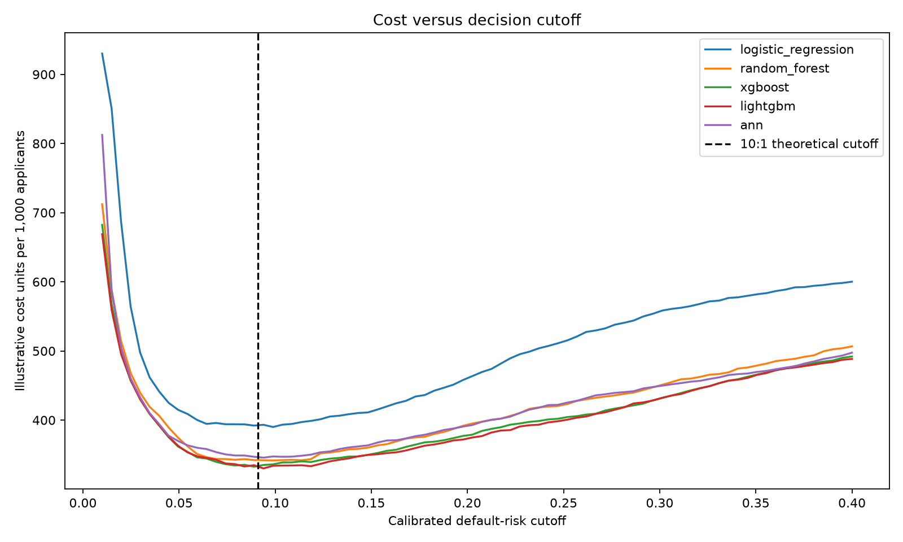
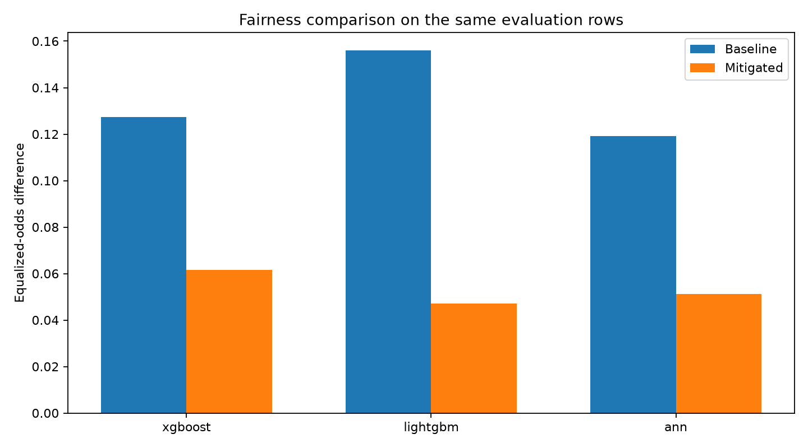
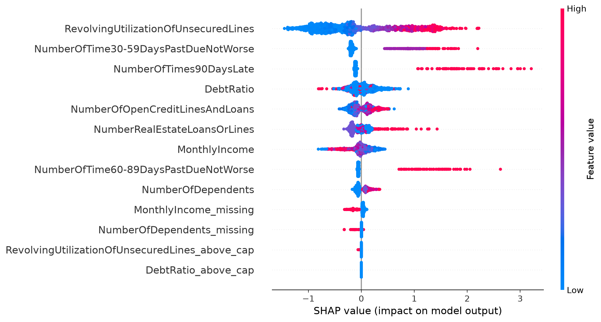
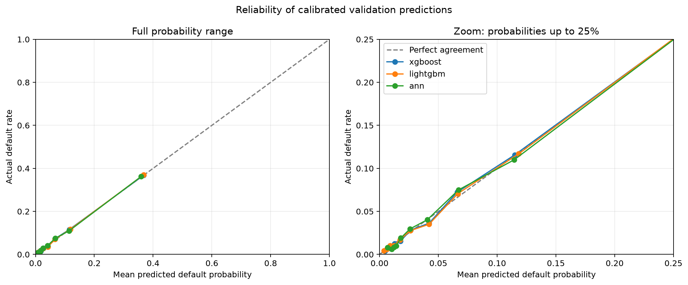

# Credit Risk Scoring with Fairness and Explainability

An end-to-end credit-risk portfolio project using Kaggle's [Give Me Some Credit](https://www.kaggle.com/competitions/GiveMeSomeCredit/data) data. The project estimates whether a borrower will experience serious delinquency within two years, then examines whether the scores are calibrated, how a decision cutoff changes mistakes and illustrative costs, and how those mistakes differ across age groups. A Streamlit dashboard lets a reader explore the findings and score a matching applicant or CSV.

**Scope:** This is a research and portfolio demonstration on historical competition data. A dashboard flag means *review under a hypothetical policy*, not an actual loan decision.

## Results at a glance

| Validation result | Value |
| --- | ---: |
| Training / validation rows | 119,999 / 30,000 |
| Observed validation default rate | 6.68% |
| Best ROC-AUC | 0.8652 (XGBoost) |
| Best average precision | 0.4001 (LightGBM) |
| Lowest calibrated Brier score | 0.0489 (LightGBM) |
| Illustrative false-negative:false-positive cost | 10:1 |
| Cost-based default-risk cutoff | 9.09% |
| Lowest illustrative cost at that cutoff | 332.9 cost units per 1,000 applicants (LightGBM) |

LightGBM is the **provisional model for the 10:1 example**. XGBoost is very close; at a 20:1 cost assumption, XGBoost has the lower measured cost. These small differences do not establish a universally best model.

## Data and preparation

The labeled `cs-training.csv` contains 150,000 rows, ten original predictors, and the target `SeriousDlqin2yrs`. The unlabeled `cs-test.csv` is used for Kaggle submissions and dashboard batch scoring. Its outcomes are not available for local evaluation.

The raw-data audit found:

| Issue | Finding | Treatment |
| --- | --- | --- |
| Imbalanced target | 93.32% no default; 6.68% default | Stratified 80/20 split; report ROC-AUC and average precision rather than accuracy alone |
| Missing `MonthlyIncome` | 19.82% of rows | Training median imputation plus a missingness indicator |
| Missing `NumberOfDependents` | 2.62% of rows | Training mode imputation plus a missingness indicator |
| Invalid age | One row with age 0 | Remove before splitting |
| Extreme utilization and debt-ratio values | Values reach 50,708 and 329,664 respectively | Cap each at its training-set 99.5th percentile; retain an above-cap indicator |
| Identical rows | 609 exact duplicates | Retain; document the choice rather than silently discarding them |

Imputation values and caps are learned **only from the training split** and saved in `data/processed/preprocessing_settings.json`. The same `prepare()` function applies them to validation, Kaggle test, the dashboard form, and uploaded CSVs. The resulting model has 13 features. **Age is excluded from model inputs** but retained to define audit groups: under 25, 25–59, and 60+. Excluding age does not remove every possible age-related pattern from other features.

## Model comparison

All five fitted models use the same training and validation split. Logistic regression and random forest provide reference points; XGBoost, LightGBM, and a small neural network (ANN) provide additional model families.

| Model | ROC-AUC ↑ | Average precision ↑ | Calibrated Brier ↓ | Illustrative cost per 1,000 ↓ |
| --- | ---: | ---: | ---: | ---: |
| Logistic regression | 0.8280 | 0.3261 | 0.0534 | 392.3 |
| Random forest | 0.8612 | 0.3857 | 0.0498 | 341.9 |
| XGBoost | **0.8652** | 0.3974 | 0.0491 | 333.7 |
| LightGBM | 0.8651 | **0.4001** | **0.0489** | **332.9** |
| ANN | 0.8570 | 0.3842 | 0.0497 | 346.4 |

The cost column uses the **calibrated 9.09% cutoff** and the illustrative 10:1 false-negative:false-positive ratio. A false negative is a defaulting applicant not flagged; a false positive is a non-defaulting applicant flagged for review. These are cost *units*, not currency or estimates of actual bank losses.

The class-weighted tree models' raw score averages were around 0.32 although the observed default rate was 0.0668. We fitted sigmoid calibrators with two-fold out-of-fold predictions on the labeled validation rows. Reported Brier scores, policy decisions, and fairness metrics use those out-of-fold calibrated predictions. A final calibrator fitted on all validation labels is saved for scoring unlabeled applicants. The validation data were also used to compare models, so these results are **not an untouched external test**.



## Cost-sensitive policy

If a missed default costs ten units and a false alarm costs one unit, the illustrative probability threshold is `1 / (10 + 1) = 0.0909`, assuming meaningful calibrated probabilities and constant error costs. LightGBM at that cutoff produces 4,137 false positives, 585 false negatives, and 332.9 cost units per 1,000 validation applicants. The dashboard allows the cost ratio and cutoff to be changed; its interactive numbers are separate from the fixed 10:1 table above.

Changing the assumed cost changes the model comparison. At false-negative:false-positive ratios of 5:1 and 10:1, LightGBM has the lowest measured cost among the five; at 20:1, XGBoost does. The assumed costs are **examples**, not costs supplied by a lender.

## Age-group fairness audit

At the LightGBM 9.09% cutoff on all 30,000 validation rows:

| Age group | Applicants | Observed default rate | Flagged for review | False-positive rate | True-positive rate |
| --- | ---: | ---: | ---: | ---: | ---: |
| Under 25 | 427 | 11.48% | 28.34% | 22.22% | 75.51% |
| 25–59 | 19,922 | 8.41% | 22.72% | 18.13% | 72.72% |
| 60+ | 9,651 | 2.91% | 9.42% | 7.94% | 58.72% |

Fairlearn measured a **demographic-parity difference of 0.1892** and an **equalized-odds difference of 0.1679** for this policy. A difference of 0.10 represents a ten-percentage-point gap. The age groups also have different observed default rates, so these gaps require interpretation, not a claim that one metric proves discrimination. The under-25 group is small.

### Mitigation experiment

A Fairlearn `ThresholdOptimizer` with an equalized-odds constraint was fitted on 15,000 validation rows and assessed on a separate 15,000. The baseline and postprocessed results below use **the same assessment rows**; they should not be compared directly with the full-30,000-row figures above.

| LightGBM on 15,000 assessment rows | Cost / 1,000 | False positives | False negatives | DP difference | EO difference |
| --- | ---: | ---: | ---: | ---: | ---: |
| Baseline 10:1 policy | 326.3 | 2,054 | 284 | 0.1903 | 0.1559 |
| Equalized-odds postprocessing, seed 42 | 350.9 | 2,904 | 236 | 0.0429 | 0.0472 |

The postprocessor reduced the measured gaps but increased false positives and illustrative cost. It uses **randomized, age-group-dependent decisions** and optimizes balanced accuracy, while the baseline uses a calibrated cost cutoff; it is an experimental trade-off, **not a recommended deployment policy**. The LightGBM EO difference varied across three random seeds (approximately 0.047–0.127). The under-25 group contained only 205 applicants in this assessment subset.



## Explanations and calibration

SHAP beeswarm and waterfall plots explain the **raw tree-model output** for LightGBM and XGBoost. The dashboard separately shows calibrated probabilities used for decisions. Across the models, delinquency history and revolving credit utilization are prominent. On a common 5,000-row validation sample, shuffling LightGBM's 90-day-late count lowered average precision by 0.0967; shuffling utilization lowered it by 0.0676. SHAP and permutation importance answer different questions and their values should not be compared as one scale.

One LightGBM false positive had several prior late payments and high utilization. SHAP explains why the model flagged that applicant, but the observed two-year outcome was no default. An applicant just below LightGBM's cutoff (9.07%) was above XGBoost's cutoff (10.10%): a concrete example of model disagreement near the decision boundary. These explanations describe learned associations, **not causal effects**.



Overall, mean calibrated predictions were about 6.7% against a 6.68% observed default rate. A reliability chart and ten equal-count bins check more than the overall average. LightGBM's mean prediction was 9.65% for under-25 applicants against an observed 11.48%, and 3.87% for applicants 60+ against an observed 2.91%; subgroup estimates need caution, especially for the small under-25 group.



## Interactive dashboard

`dashboard.py` provides seven views: overview, data quality, five-model comparison, interactive policy and age-group audit, SHAP explanations, calibration, and applicant scoring. It accepts either a ten-field form or a CSV with the same ten input columns. `MonthlyIncome` and `NumberOfDependents` may be blank. The scoring path loads the saved preprocessing settings, selected model, and its calibrator. The form and a matching one-row CSV both produced **1.25%** for the verified LightGBM example.

A dashboard upload of the competition's `cs-test.csv` produced **101,503 finite scores with unique IDs**. The downloaded dashboard CSV includes age group and policy flag. It is **not** Kaggle's required `Id,Probability` submission format; use the submission script for Kaggle. Since test outcomes are hidden, its scores cannot establish test accuracy, calibration, or fairness.

## Run locally

Use Python in a virtual environment. From the repository root on Windows PowerShell:

```powershell
python -m venv .venv
.\.venv\Scripts\Activate.ps1
python -m pip install -r requirements.txt
```

Download the three original files from the [competition data page](https://www.kaggle.com/competitions/GiveMeSomeCredit/data) and place them at:

```text
data/cs-training.csv
data/cs-test.csv
data/sampleEntry.csv
```

Run the scripts in this order:

```powershell
python 01_eda.py
python 02_prepare_data.py
python 03_train_models.py
python 04_evaluate_policies.py
python 05_make_submissions.py
python 06_mitigation.py
python 07_explainability.py
python 08_reliability_check.py
streamlit run dashboard.py
```

The scripts write processed data to `data/processed/` and models, tables, and charts to `outputs/`. Training and mitigation can take several minutes. `project_config.py` holds the seed and illustrative policy costs; `pipeline_utils.py` shares preprocessing and score transformations. Keep original Kaggle data and model binaries out of Git unless you have verified the repository's intended distribution and size. Commit the selected charts referenced above if you want GitHub to display them without rerunning the pipeline.

## Limitations and next steps

- This historical competition sample does not establish performance for current applicants, another country, or a live lending population.
- The labeled validation split was reused for calibration, model comparison, and several audits. Out-of-fold calibration reduces in-fold scoring bias, but model selection still uses the same labeled split. A future study should reserve a fresh labeled holdout or use a stronger nested evaluation design.
- No gender attribute is supplied; this project audits only the chosen age buckets, and other sensitive attributes or intersections remain unmeasured. Excluding age from features does not eliminate correlated proxies.
- Fairness metrics depend on the target definition, decision cutoff, subgroup sizes, and mitigation objective. A smaller gap can come with higher false-positive cost. The randomized postprocessor also requires age-group information at inference.
- The 10:1 error-cost ratio is illustrative. Real credit decisions would need validated economics, data quality controls, monitoring, and governance that this portfolio project does not provide.

**Libraries:** pandas, NumPy, scikit-learn, XGBoost, LightGBM, Fairlearn, SHAP, Matplotlib, Seaborn, Streamlit, and joblib.
